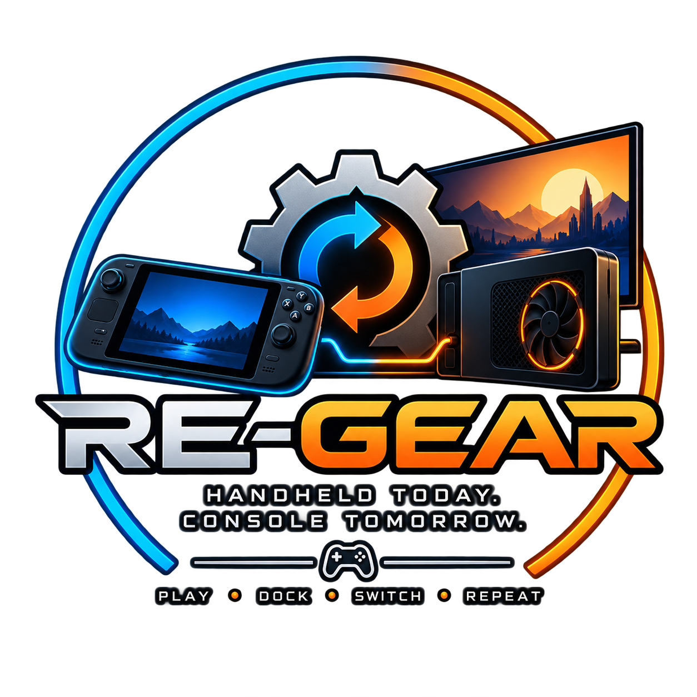

# Re-Gear

**A games-first companion for SteamOS handheld PCs**

Clear status, useful controls, and guided recovery—built to make handheld gaming feel more like a console.

    

[Player Guide](https://github.com/ronnierosal/Re-Gear/wiki) · [Current status](#-current-status) · [Development](#-development) · [Contributing](CONTRIBUTING.md)

> [!IMPORTANT]
> Re-Gear is experimental and in active development. GitHub development candidates exist, but there is no supported general-availability release or end-user installer yet. Features and hardware support depend on the exact build, device capabilities, and validation evidence.

## 📖 About

Re-Gear is a Decky Loader companion for SteamOS handhelds. It brings system
status, everyday controls, and deeper configuration together so players can
spend more time playing and less time troubleshooting.

The project covers handheld and docked play, displays and eGPUs, performance
and power, controllers, and offline play readiness. These areas are at different
stages of development. Re-Gear is designed across hardware vendors; compatibility
is established for individual capabilities and tested configurations.

Games come first: keep the common actions easy to reach, put technical detail
behind troubleshooting, and keep background work bounded. When evidence is
missing, show the uncertainty. When an action changes the system, verify the
result and preserve a recovery path.

## 🎮 Command Center and modules

The approved interface direction is a **Command Center** for quick controls
and status, with **Modules** for deeper settings. The rebuild is in development;
the complete new interface is not yet delivered on main.

<!-- Future screenshots: add real, reviewed Command Center captures here after
native Decky/controller validation. Record build, view and capture evidence in
the linked guide. Do not substitute design mockups for shipped UI screenshots. -->

| Area | What it helps with | Development status and guide |
|---|---|---|
| Command Center | Quick controls, readable status, and navigation to modules | Existing Quick Access navigation is implemented; the new shell and layout are in development. [Interface guide](https://github.com/ronnierosal/Re-Gear/wiki/Command-Center) |
| eGPU and displays | Understand connected hardware, guarded display changes, and recovery | Guarded workflows are implemented with bounded test results; repeatability and live disconnect remain unvalidated. [eGPU guide](https://github.com/ronnierosal/Re-Gear/wiki/eGPU-and-Docking) |
| Performance and power | Manual power limits and optional FPS-target Auto TDP | Controls exist in development source; provider and hardware acceptance remain. [Performance guide](https://github.com/ronnierosal/Re-Gear/wiki/Performance-and-Power) |
| Controllers | Reach actions comfortably and understand input capabilities | Routing foundations exist; broader configuration and device support are in development or research. [Controller guide](https://github.com/ronnierosal/Re-Gear/wiki/Controllers) |
| Offline Readiness | Check local game evidence before leaving Wi-Fi | Selected-game guidance and badges are implemented; confidence is not an offline-launch guarantee. [Offline guide](https://github.com/ronnierosal/Re-Gear/wiki/Offline-Readiness) |

## 🚦 Current status

Re-Gear remains a development project. Merged source, packaged builds, installed
software, and hardware-tested behavior are separate milestones.

See [Current State](https://github.com/ronnierosal/Re-Gear/wiki/Current-State)
for the reviewed implementation checkpoint and remaining gates,
[Feature Roadmap](https://github.com/ronnierosal/Re-Gear/wiki/Feature-Roadmap)
for development priorities, and
[Confirmed Hardware Testing](https://github.com/ronnierosal/Re-Gear/wiki/Confirmed-Hardware-Testing)
for capability-specific results. Exact source and operational evidence stays in
the [repository documentation](docs/INDEX.md).

## 💾 Getting started

Start with the [player guide](https://github.com/ronnierosal/Re-Gear/wiki/Getting-Started).
Current builds are controlled validation artifacts. Selecting a ZIP by its
version number alone does not establish that it is suitable for installation.
Hardware testing uses an exact revision, verified checksum, and a supervised
validation plan.

## 🛡️ Safety first

Re-Gear keeps game state, rendering GPU, active display, and connected hardware
independent. Guarded actions require fresh evidence; a running game is never
migrated between GPUs.

**Current testing does not establish safe physical live eGPU removal.** Follow
the shutdown-before-disconnect policy and confirm complete physical power-off.
A clear client scan, a working handheld display, or an accepted shutdown request
does not establish unplug safety. See
[Safety and eGPU Handling](https://github.com/ronnierosal/Re-Gear/wiki/Safety-and-eGPU-Handling).

## 🛠️ Development

The backend uses Python; the Decky interface uses TypeScript and React.
Start with [AGENTS.md](AGENTS.md), [Contributing](CONTRIBUTING.md), and the
[development workflow](docs/DEVELOPMENT.md) for setup, tests, and verification.
[Architecture](docs/ARCHITECTURE.md) explains the shared state and guarded
transition boundaries. [Release pipeline](docs/RELEASE_PIPELINE.md) covers
controlled artifacts and the separate publication gates.

## 📚 Documentation

- **README:** the project, its main areas, and where to start.
- **[Wiki](https://github.com/ronnierosal/Re-Gear/wiki):** detailed feature guides, usage, compatibility, and limitations.
- **[Internal documentation](docs/INDEX.md):** engineering contracts, exact evidence, and historical records.
- **[Issues](https://github.com/ronnierosal/Re-Gear/issues):** bugs and bounded work; **[Discussions](https://github.com/ronnierosal/Re-Gear/discussions):** project conversations.

## 🤝 Contributing

Players can help with clear bug reports and reviewed compatibility evidence.
[Help Improve Re-Gear](https://github.com/ronnierosal/Re-Gear/wiki/Help-Improve-Re-Gear)
explains what to include and how to preview diagnostic information before sharing.
Contributors should keep changes focused and preserve the project's verification
and recovery rules.

## 📜 Licensing

Re-Gear's community distribution is licensed under the
[GNU General Public License version 3 or later](LICENSE) (`GPL-3.0-or-later`).
Commercial/OEM integration, redistribution, bundling, customization, support,
or branding under terms outside GPLv3+ requires a separate negotiated license;
see [licensing](docs/LICENSING.md). Third-party notices remain in
[THIRD_PARTY_NOTICES.md](THIRD_PARTY_NOTICES.md).
