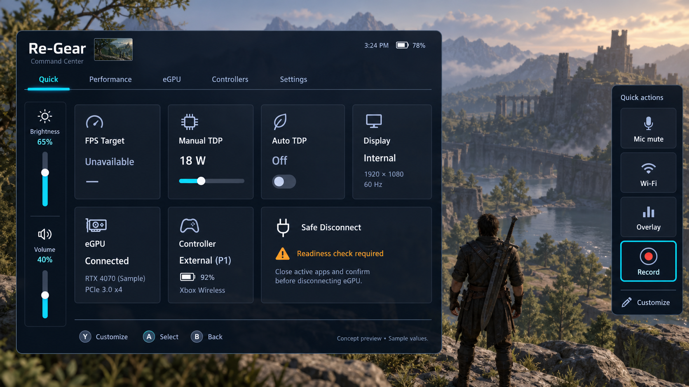

# Approved Command Center design

Recorded from Ronnie's supplied reference and strict design handoff on 2026-09-10,
with the responsive/layout correction explicitly approved on 2026-09-12
(America/Los_Angeles). This is the visual target, not an installed screenshot or
proof of supported hardware. The user requested these notes and anti-drift rules;
the attachment's implementation commands and final-response format do not expand
that documentation task or override repository safety/ownership instructions.

## Authority and fidelity

Implement this composition, not an agent's preferred redesign. It supersedes
earlier concepts where they conflict. Preserve structure, grouping, hierarchy,
visual language and control placement. The image communicates proportions rather
than literal pixel coordinates. Use existing Re-Gear components and branding;
do not copy sample hardware values, time, battery readings or game artwork into
the shipped UI. Unknown data must remain explicit and controls remain visible
but unavailable when their adapter is absent.

The reference was supplied by the user from the earlier generated concept.
Its utility-rail arrangement was inspired by the user's ROG Ally Command Center
reference; it is design inspiration, not imported ASUS code/assets. The PNG is
a documentation reference only and must not be bundled as game art or UI assets.
Existing source-attribution requirements still apply to delivered adaptations.

## Workstream ownership

The Command Center presentation is a dedicated UI workstream. ChatGPT owns the
visual structure, spacing, responsive behavior, icon treatment, focus treatment,
card hierarchy, modal/popup presentation and consistency across Re-Gear screens.
Codex and Claude Code may wire adapters, state, actions and backend behavior into
the approved component contracts, but must not independently redesign the UI while
doing so.

When wiring code, preserve the existing visual contract unless an actual platform
constraint makes it impossible. If a wiring task exposes a design problem, record
the problem separately and hand it back to the UI workstream instead of silently
changing widths, card sizes, tabs, colors, labels, rails or hierarchy.

UI-only changes should remain isolated from eGPU/runtime lifecycle behavior.
Runtime wiring should consume the visual/navigation contracts rather than embed
backend-specific layout decisions in presentation components.

## Required composition

| Area | Required design |
| --- | --- |
| Main panel | Left portion of screen, dark translucent navy; game remains visible. Scale proportionally across handheld viewport sizes rather than preserving one fixed narrow width. No full-screen settings page or stock narrow Decky sidebar. |
| Header | Re-Gear / Command Center; small current-session thumbnail and time/battery status when verified sources exist. No fabricated readings. |
| Tabs | Quick Access, Performance, eGPU, Controllers, Settings horizontally; cyan selected text/underline, compact spacing, no oversized card tabs. The selected Quick Access tab is sufficient identification: **do not repeat a Quick Access title or “Essential controls while you play” subtitle above the tile grid.** |
| Left utility strip | **Inside the main Command Center body**, slim dedicated column: sun icon, Brightness, percentage and vertical slider; divider; speaker icon, Volume, percentage and vertical slider. It should read as part of the main Re-Gear panel rather than two detached cards. Do not convert these to horizontal cards or move them into the right panel. |
| Quick row 1 | FPS Target, Manual TDP, Auto TDP, Display. Icons and titles above separate values/details; adjustment affordance, TDP slider and Auto TDP toggle only dispatch through verified existing adapters. |
| Quick row 2 | eGPU, Controller, Safe Disconnect spanning the remaining two columns. Safe Disconnect has distinct readiness emphasis and truthful warning/result wording. |
| Right panel | Detached narrow action rail close to the right edge for direct thumb access, visible when the menu opens. Stacked Mic mute, Wi-Fi, Overlay, Record buttons. **Do not add a redundant “Quick actions” heading above the buttons.** Buttons scale with available viewport height/width instead of retaining fixed desktop-like dimensions. Game remains visible between panels. |
| Footer | Compact controller prompts, including Y Customize where available, A Select and B Back; retain LB/RB tab navigation. Do not add a fake Xbox/Menu button; SteamOS already owns the system menu surface. |

The current default right list is **Mic mute, Wi-Fi, Overlay, Record**, superseding
the earlier Audio output default. Audio output can remain an optional customization
choice. Do not mix conflicting defaults from older chat notes. The target keeps
brightness/volume on the left; any earlier proposal to freely swap those rails
does not override this explicit arrangement. Customization chooses supported
quick actions without silently moving the defining utility strip.

## Menu consistency rules

All top-level Re-Gear sections must look and behave like one product, not separate
plugins sharing a logo. Quick Access, Performance, eGPU, Controllers and Settings
must reuse the same shell, tab bar, title spacing, card radii, border weight,
focus treatment, icon sizing and typography scale.

Quick Access is the densest action surface. Deeper module tabs may use fewer and
wider cards, but they should not invent a different design language. Prefer the
same reusable patterns:

- compact status/action card
- wide status/action card
- toggle card
- slider card
- warning/readiness card
- detail page reached from a card
- shared popup/modal primitives

Keep one semantic color system everywhere: cyan = focus/active/progress, green =
verified success, amber = warning/action required, red = genuine failure, muted
blue-gray = secondary/unavailable. Do not use color simply for decoration.

## Navigation contract

Navigation visuals and behavior are part of the UI contract even when action
implementation is owned elsewhere.

- LB/RB: switch top-level tabs.
- D-pad: move spatially through cards and rails.
- A: select/open/activate the focused item.
- B: leave a nested view first, then close the Command Center.
- Y: Customize when that destination is actually wired.
- Brightness/Volume remain directly focusable vertical controls.
- Right quick-action buttons remain directly focusable without entering another page.
- Focus should restore to the previous item when returning from a nested page.
- No navigation path should require touch or mouse.

The footer should only advertise actions that are actually available in the current
state. Do not show a nonfunctional prompt merely to match a mockup.

## Data and interaction

- eGPU: observed connection, detected GPU and useful link information. Display
  attachment, active output and rendering GPU remain separate observations.
- Controller: observed controller identity, assignment and battery only where
  actually available. A sample P1 or battery is not a production fallback.
- Safe Disconnect: readiness required, blocked, pending and result states must
  follow existing safety contracts. Successful commands or absent devices never
  establish physical unplug clearance. Do not weaken wording to match sample copy.
- Brightness/volume: vertical cyan progress, subdued track and visible thumb.
  No replacement with +/- unless a documented platform constraint requires it.
- Recording: requested Steam Game Recording action; dismiss Command Center before
  requesting start and verify actual capture behavior. No invented support.
- LB/RB changes tabs; D-pad follows spatial position across regions; A activates;
  B backs out of nested interaction then closes; Y opens customization where wired.
  Touch targets on the right must be reachable directly, without opening an editor.
- Do not show working toggles/sliders or fake completion without verified state
  and dispatch. Track missing APIs, customization and persistence independently.

## Anti-drift and responsive rules

Keep dark navy surfaces, restrained borders/depth, modest radii, cyan active/focus
accents, white primary text, blue-gray secondary text and amber warnings. Green
requires verified state. Do not introduce new colors, branding, giant icons,
excessive gradients/glow, charts, extra tabs, diagnostics in Quick, generic lists,
merged rails or unrelated refactors. Deeper settings belong in module tabs.

Responsiveness is part of the design, not a fallback. Test the known 828x466 CSS
pixel handheld case plus wider 720p/1080p-style viewports. Scale panel width,
rail width, action height, icons, gaps and secondary typography together. At
reduced space, first adjust gaps/padding and secondary wording; preserve words,
controls and important actions. Do not silently remove either rail or collapse
into a vertical settings page. If no usable arrangement exists at a supported
size, record the exact constraint and bounded deviation. Reference fidelity does
not justify unusable touch targets, focus traps or bypassing hardware safety.

## Acceptance and review evidence

- [ ] Left main panel and detached right action rail are recognizable against the approved composition.
- [ ] Brightness and volume visually belong inside the main body, use vertical sliders and retain readable unavailable/live states.
- [ ] Quick root has no duplicate title/subtitle between tabs and cards.
- [ ] Exact five tabs, four-card first row, eGPU/controller/wide disconnect row.
- [ ] Right default actions are Mic mute, Wi-Fi, Overlay, Record; no redundant rail heading.
- [ ] Right action buttons scale proportionally and remain thumb/controller friendly at the tested viewport sizes.
- [ ] Header, proportions, rail widths, card spacing, text hierarchy and cyan focus compared directly with reference; intentional deviations explained.
- [ ] Actual baseline/proposed source rendered at identical handheld dimensions (including 828x466 CSS pixels) and a wider case, with real breakpoints.
- [ ] No clipped headings, broken words, obscured Safe Disconnect or oversized footer; spatial focus, touch, nested Back and slider interaction checked.
- [ ] Unavailable controls explicit; no fabricated values or backend side effects.
- [ ] Affected tests, typecheck/build and final integrated checks pass.
- [ ] Report exact revision, files/components, wired sources, unavailable features, capture locations and any deviation. Native validation remains separate.

## Implementation status at this correction

The earlier PR #288 (`2df6d05`) mounted visible unavailable rails but did not meet
this target: the utility strip rendered outside the central panel, the right rail
used fixed geometry and Audio output as a default, and very narrow styling could
hide both rails. The 2026-09-12 responsive-polish work corrects those presentation
contracts in source while keeping unavailable capabilities truthful. Live utility
APIs, customization/persistence and native-device acceptance remain separate from
this visual correction until validated on the actual handheld.
