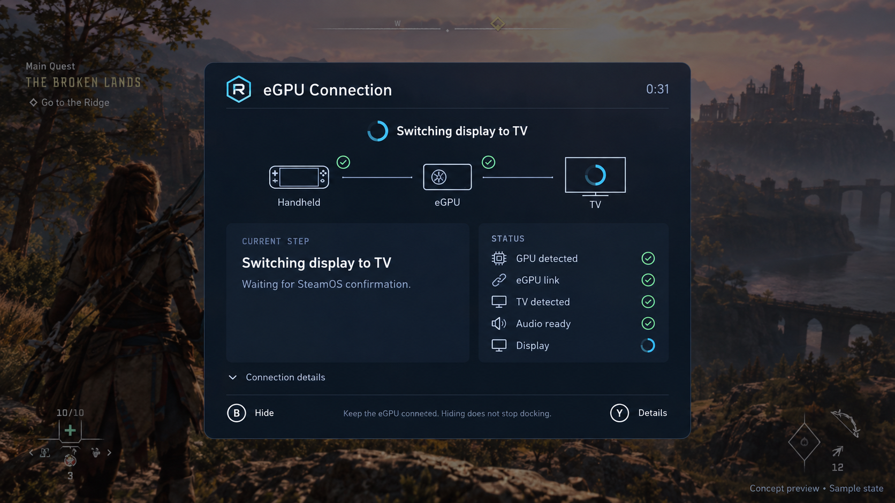

# Approved compact connection popup

Ronnie approved this concept on 2026-09-10 and explicitly required animation,
existing repository icons, and fit within the Ally's effective SteamOS viewport.
This supersedes PR291's connection popup composition only. Confirmations and
other Command Center surfaces retain their separate contracts.

The concept is a generated placement reference, not shipped artwork or runtime
evidence. Its simulated game background and icon imitations are not imported into
the UI. Actual source uses regear-icon.svg, mode-handheld.svg, mode-tv.svg, and the
existing CommandCenterIcon/StatusIcon family. No new success glyphs or emoji.

## Composition and limits

- Compact console card, navy surfaces, subtle borders, cyan progress/focus.
- Normal width 55–65% of effective viewport; normal height 45–60%. The reference
  image is taller than requested: use the numeric compact target, not its height.
- Inline logo and eGPU Connection title; elapsed m:ss at right. Persistent actual
  operation header, not an unconditional three-stage timeline.
- Horizontal Handheld–eGPU–TV path. Handheld is a neutral endpoint, not a checked
  readiness claim. eGPU link is confirmed only from both fresh GPU and link checks.
  A detected TV is explicitly not an active display. Only fresh completed phase
  reports TV switch complete; no attachment/absence-based completion inference.
- Current-step and core-status cards. Preserve GPU/driver, link, HDMI detection,
  audio recovery readiness and display setup prerequisites. Readiness does not
  establish active audio or completed display activation.
- Details collapsed by default. Only expanded diagnostics scroll. Full reasons
  remain in details; short current-step summary can wrap, with complete text
  available through touch or the native options/Y action.
- Compact B Hide and Y Details buttons. Retain an existing supported Switch to TV
  action when supplied. Hiding never cancels docking or dispatches a new action.
- Small amber delayed notice; known blockers and settled TV-off waits must not be
  described as generic connection delay. No fake percentage or completion deadline.

## Motion and interaction

Primary waiting and an explicitly switching display path pulse subtly; diagnostic
unknowns remain static. Operation text fades on change; entrance is brief. Hide
uses a 140ms exit animation before native Close, with repeat-Hide protection and
unmount cancellation. Reduced motion bypasses these animations. Automatic success
uses its existing fresh 3.5-second dwell and closes directly: no extra exit delay
is allowed to outlive the last freshness/interaction check. Confirmation semantics
remain delegated to native ConfirmModal.

B hides; native options/Y toggles details without dispatch. Pointer, keyboard,
focus and native direction/button activity renew the success dwell. Open details
hold auto-dismissal. Native propagation, focus containment/restoration and Ally
scaling remain separate device checks, not claims proven by browser mocks.

## Anti-drift and evidence

Baseline: 1ddd84a60057bedb722ef00b927cd2f10705e493. Compare actual baseline/proposed
source with identical fixtures at 828x466, 1280x720, 1280x800 and 1920x1080. Do not
shrink all text or introduce a default scrollbar to force fit. Status text is at
least 12px at the smallest required viewport; smaller captions are metadata only.
Use spacing before reducing readable content. Keep all required controls visible.

`scripts/popup_system_preview.mjs` produces default, expanded and scrolled captures
for eleven cases at each size and measures bounds. `REGEAR_POPUP_BASELINE=1` disables
new compact-target assertions when capturing the historical source. Native
confirmation chrome is explicitly simulated; connection content is actual source.
Retain frame/header/footer bounds, internal scrolling, focus, motion and reduced
motion evidence alongside the source revision. This is not an installed screenshot.

Broader all-family adoption and per-operation status integration remain owned by
Claude in the shared-popup task. This compact connection change does not complete
those migrations or authorize installation, session restart or hardware mutations.
