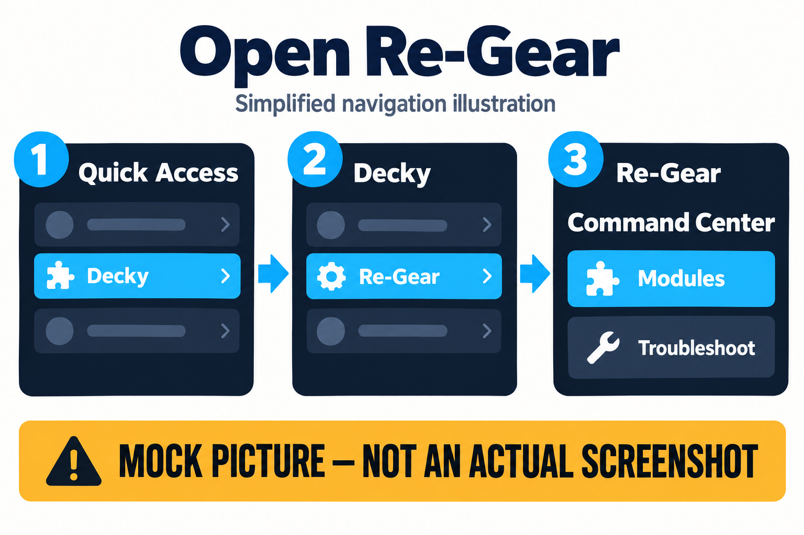
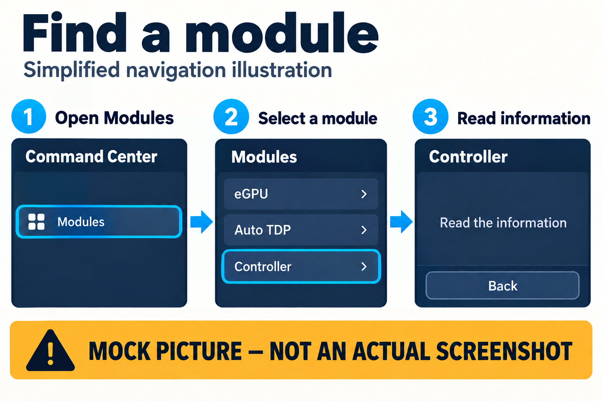

# Getting started with Re-Gear

Re-Gear is a Decky plugin for SteamOS handhelds. Start by checking which build you
have, then open its controls. You do not need a terminal for this guide.

## For players — no technical background needed

### Availability

Re-Gear is under development. GitHub development builds and mockups are not a
supported public release. Follow the installation instructions for an explicitly
coordinated test build; do not install another candidate just to match a picture.
See [installation](manual-installation.md) and [hardware evidence](supported-hardware.md).

### Open Re-Gear

1. If Re-Gear is already installed, open Steam's **Quick Access** panel, then **Decky**.
2. Select **Re-Gear** from your installed plugins.
3. Read the screen and available controls. The earlier documented interface opens
   **Command Center**, with **Modules** and **Troubleshoot**. New UI test candidates
   can use a different landing page; follow the labels in your installed build.

*Mock picture: labels and sequence illustrate the earlier source interface, not
exact placement or the newer uninstalled UI candidate. If Re-Gear is missing,
report your installed build.*

### Find a module in that interface

1. Select **Modules** from **Command Center**.
2. Select **Controller** to read its information and availability message.
3. Use **Back** to return. Opening the page does not apply a setting.

*Mock picture: “Read the information” is an instruction, not a literal status.*

**Decky** is the plugin system. A **module** is a section for a feature.
**Quick Access** is Steam's side panel. Use the
[Command Center guide](command-center.md), [short tutorials](tutorial-cards.md)
or [troubleshooting](troubleshooting.md) next.

## Technical details — for advanced users and contributors

The numbered opening/module flow and generated pictures were reviewed against
[source ab87e2e](https://github.com/ronnierosal/Re-Gear/commit/ab87e2e0f6b7beb462cacdc7f83e2f5d280844db).
They are not native validation of later UI builds. See [current evidence](../technical/current-state.md)
and [asset provenance](../assets/player-manual/README.md). Keep real screenshots
labelled by installed build when they replace these placeholders.
