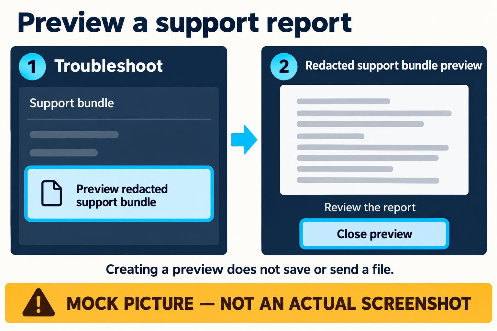

# Player Troubleshooting

This page is for problems a player can reasonably diagnose without opening a terminal.

## For players — no technical background needed

### Re-Gear looks stuck

Give an in-progress transition a moment to finish and read the status shown in the interface. Avoid repeatedly triggering the same hardware transition while Re-Gear says it is still working.

> 🖼️ **UI MOCKUP — Progress / needs-attention states**  
> **TEMPORARY IMAGE PLACEHOLDER**  
> Suggested asset: `assets/wiki/mockups/troubleshooting-status.png`

### A Quick Access action is unavailable

Some actions depend on a feature, device, or current state. An unavailable action does not necessarily mean Re-Gear is broken. Open the related module page for more context.

### My layout is wrong

For newer test candidates, see [Reset Quick Access](how-to/reset-quick-access.md).
Those exact installed steps remain unverified; do not assume a reset control
exists in your build or use it as a remedy for unrelated display/focus problems.

### eGPU or docking problem

Follow the state shown by Re-Gear and avoid physically disconnecting active external graphics hardware merely to clear an error. The supported recovery guidance will expand as the eGPU lifecycle reaches further hardware validation.

### Still having trouble?

When reporting a problem, useful player-level details include:

- what you were trying to do
- what Re-Gear displayed
- what happened instead
- whether you were playing handheld or on an external display
- the Re-Gear version
- your handheld/eGPU/controller model when relevant

Use [Diagnostics and Privacy](diagnostics-and-privacy.md) for the reviewed support
preview, and [Help Improve Re-Gear](help-improve.md) to report a problem. Do not
repeat a risky failure just to collect a report.

*Mock picture, not a screenshot. Select **Troubleshoot**, then **Support bundle**
and **Preview redacted support bundle** where available. Review the preview before
copying or saving; creating a preview does not send or save a file.*

## Technical details — for advanced users and contributors

[Scripts and evidence limits](../technical/scripts-and-ci.md) separates read-only
probes from execution. [Diagnostics](../../DIAGNOSTICS.md) and
[support bundle](../../SUPPORT_BUNDLE.md) own export/privacy behavior. UI clipping
or focus reports should name the installed build, screen and action; report the
problem without changing display scale or attempting unrelated hardware steps.
