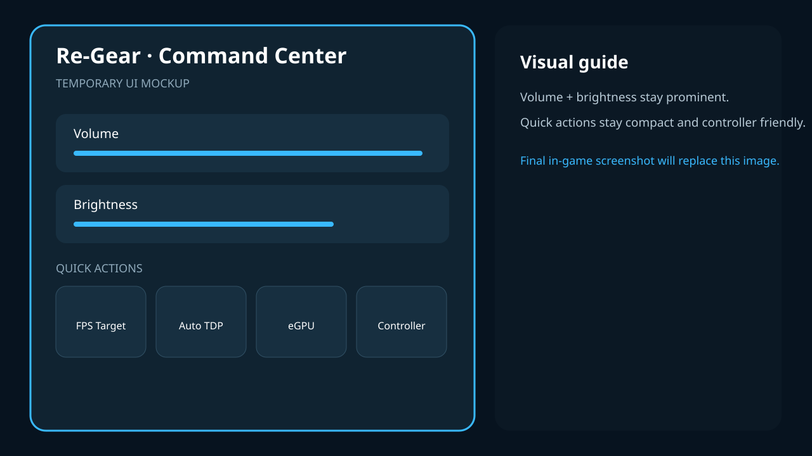

# Visual guide to the developing interface

These labelled UI mockups explain the proposed menu organization. They are not
screenshots or proof of installed behavior. Use [getting started](getting-started.md)
for the earlier verified source navigation and build-specific instructions.

## For players — no technical background needed

Read [Command Center](command-center.md), [performance](performance.md),
[eGPU](egpu.md), [controllers](controllers.md), and [customization](customize.md)
alongside their availability notes. Mock values and menu names can differ from
your build. Do not follow a mock **Ready to disconnect** state as cable clearance.

### Command Center

### Performance

### eGPU

### Controllers

### Settings

### Customization

### Quick Access tasks

## Technical details — for advanced users and contributors

Mockups are design evidence only. [Current implementation status](../technical/current-state.md)
and the [UI contract](../../UI_DESIGN_CONTRACT.md) govern implementation claims.
The [how-to index](how-to/README.md) labels tasks whose exact installed steps
remain unverified. Real screenshots should record the installed build.
