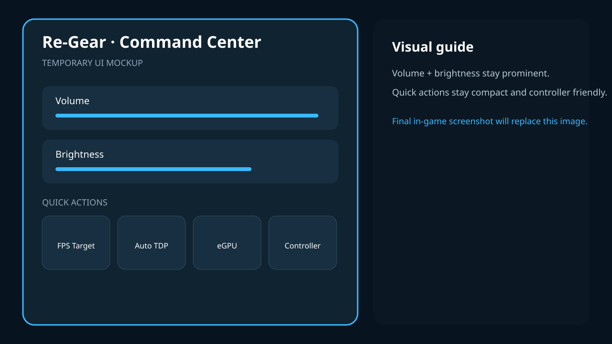
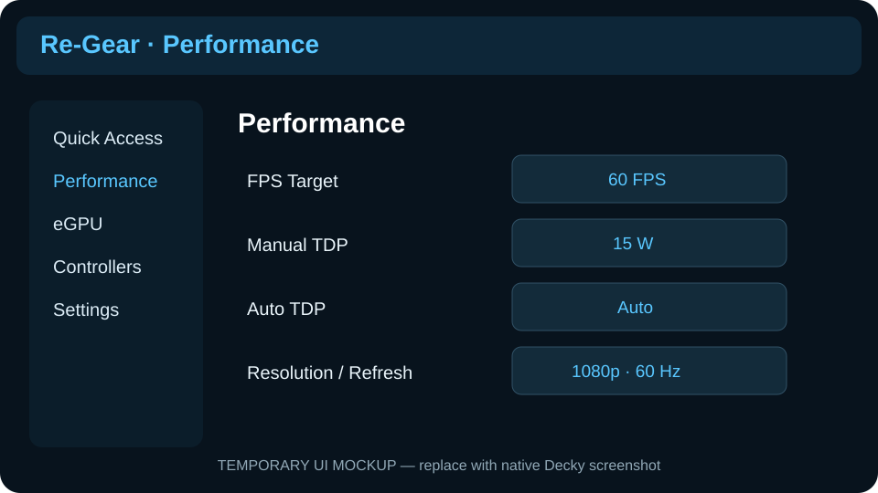
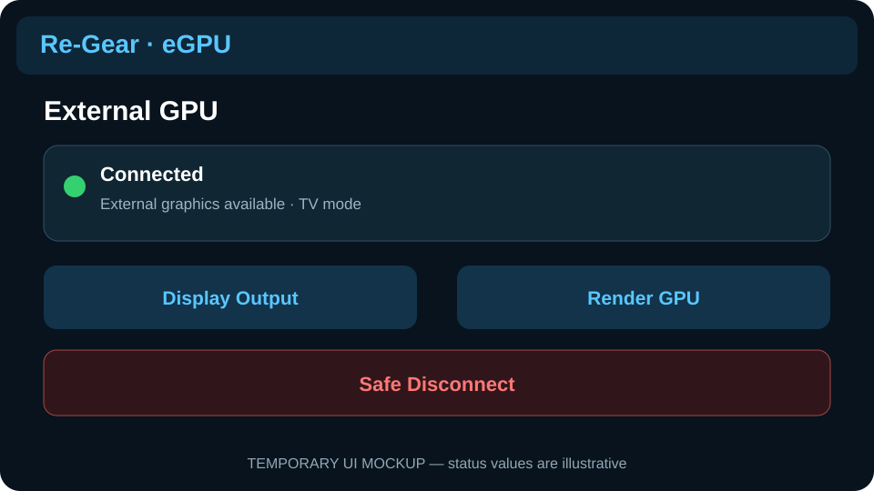
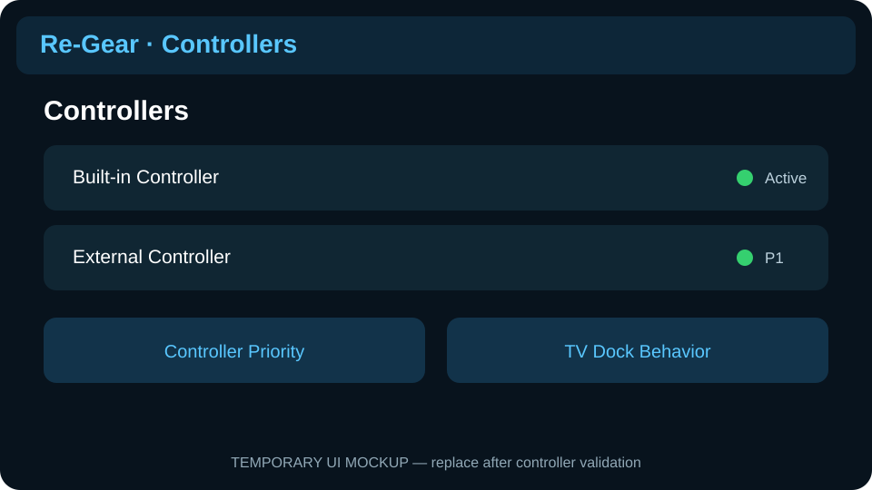
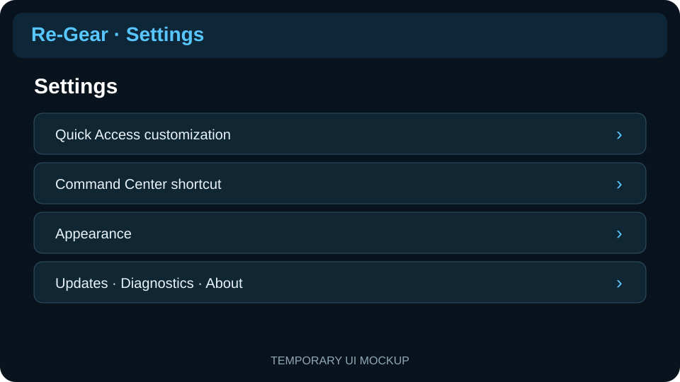
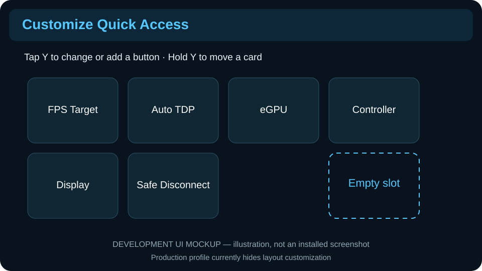
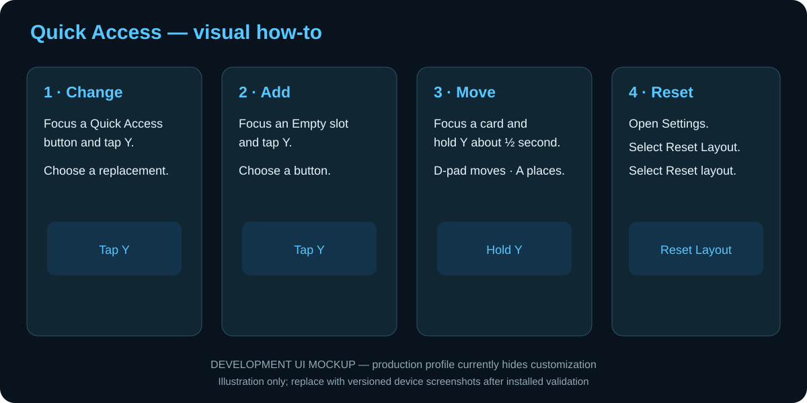

# Visual guide to the developing interface

These labelled mock pictures help you recognize Re-Gear's developing menus and
controller flows until device screenshots are available.

## For players — no technical background needed

These are illustrations, not screenshots or proof of installed behavior. The
full multi-tab interface and layout editing are implemented in development
source and hidden by the current production profile. Use the labels in your
coordinated build and read each linked guide's availability note.

Mock values are examples. Never treat a pictured **Ready to disconnect** state
as cable clearance; follow the live instructions in [eGPU](egpu.md).

### Command Center

[How the Command Center works](command-center.md)

### Performance

[Performance and power](performance.md)

### eGPU

[eGPU guide](egpu.md)

### Controllers

[Controllers guide](controllers.md)

### Settings

### Customize Quick Access

On **Quick Access**, tap **Y** to replace or add a button. Hold **Y** for about
half a second to move a card. Use **Settings → Reset Layout** to restore the
default layout. [Read the customization guide](customize.md).

### Step-by-step Quick Access tasks

- [Change, add, or remove a button](how-to/change-quick-access-button.md)
- [Move cards](how-to/rearrange-quick-access.md)
- [Reset the layout](how-to/reset-quick-access.md)

## Technical details — for advanced users and contributors

Mockups are explanatory assets, not validation evidence. Their labels align
with current merged development source, while availability remains governed by
the [production profile](../../RELEASE_PIPELINE.md#development-and-production-profiles)
and [current evidence](../technical/current-state.md). Replace a mock only with
a privacy-safe screenshot that records the installed version and revision.
