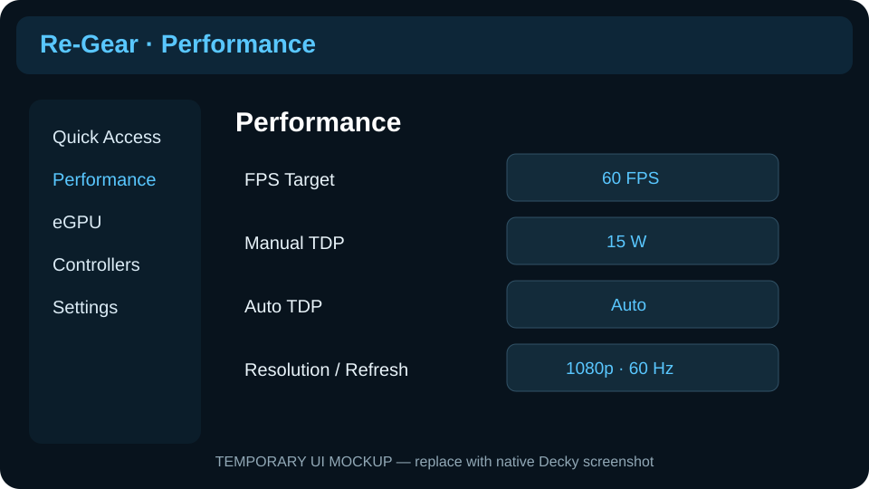
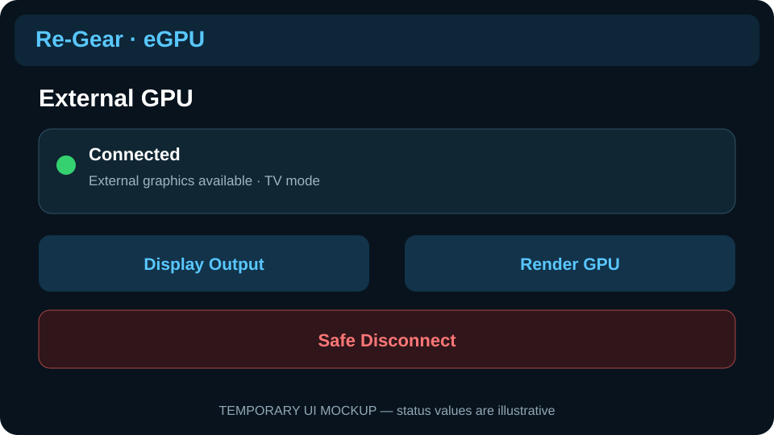
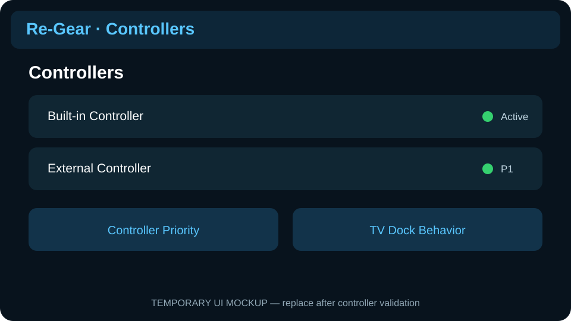
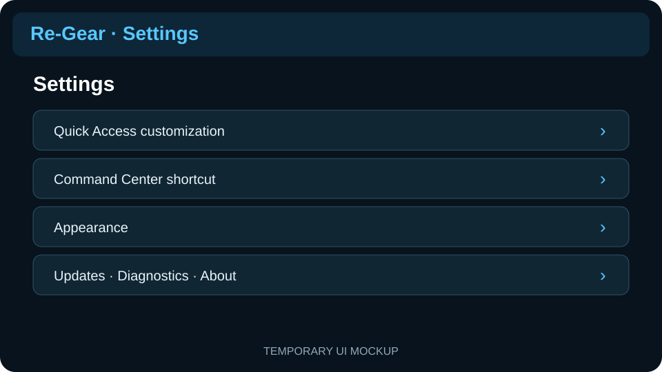
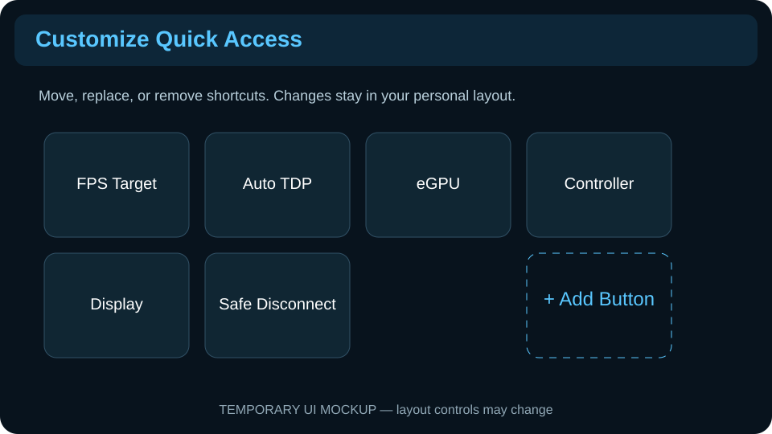
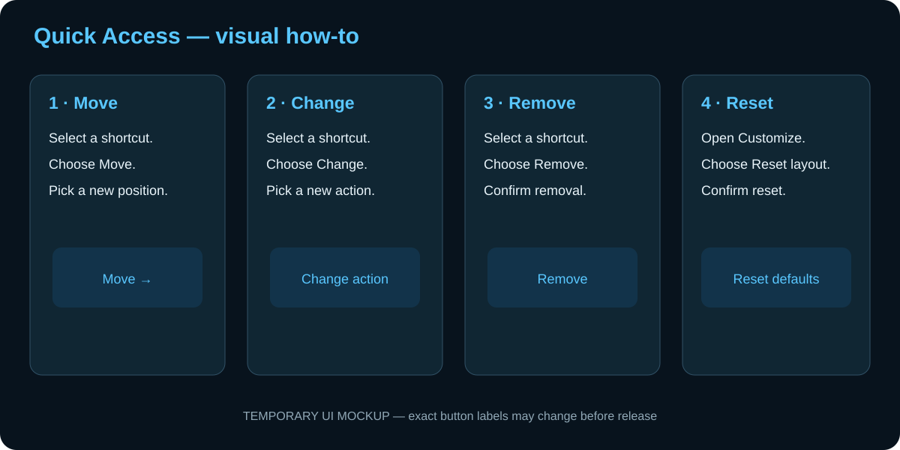

# Player Visual Guide

**Audience:** players  
**Status:** temporary visual documentation

> [!IMPORTANT]
> The pictures on this page are **UI mockups**, not proof of the current installed interface. They are temporary documentation aids and will be replaced with native SteamOS/Decky screenshots after the related UI is validated.

## Performance

Use the Performance page for deeper frame-target, TDP, Auto TDP, resolution, and refresh configuration. Quick Access should keep only the controls you want during play.

## eGPU

The eGPU page should make current connection/display state and the next safe action easy to understand. Mock status values are illustrative; follow the actual Re-Gear status on an installed build.

## Controllers

Controller information is presented in player language: which controller is active, player priority, and dock-related behavior.

## Settings

Settings contains personalization and configuration that does not need to occupy the in-game Command Center.

## Customize Quick Access

Quick Access is intended to be personal. Keep frequent in-game actions easy to reach and move deeper configuration into its module page.

## Move, change, remove, or reset buttons

### Move a button
1. Open **Settings → Quick Access / Customize**.
2. Select the shortcut.
3. Choose **Move**.
4. Pick its new position and confirm.

### Change a button
1. Select the shortcut you want to replace.
2. Choose **Change**.
3. Pick another available action.
4. Confirm the new shortcut.

### Remove a button
Select the shortcut, choose **Remove**, and confirm. Removing a shortcut does not remove the underlying Re-Gear feature.

### Reset the layout
Open Quick Access customization, choose **Reset layout**, and confirm. This restores Re-Gear's default arrangement.

## Command Center

See [Command Center](Command-Center) for the current player-facing explanation and its temporary overview visual.

---

**Documentation rule:** mockups explain intended navigation and information hierarchy. Native screenshots are the authority for the final visual appearance.